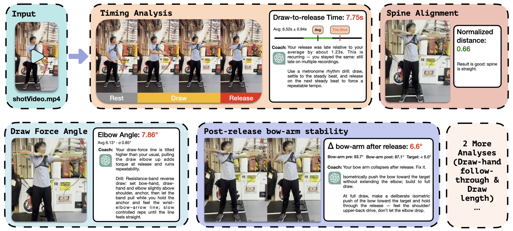

<h3 align="center">
  
  
  <br>
  STRAIGHT: Toward Consistent Archery Form via Video Pose Analysis and Language-Model-Based Coaching Feedback
</h3>

<h3 align="center">
  <i></i>
</h3>

<!-- <div align="center">
  <a href="https://github.com/straight-anon/STRAIGHT"></a>
  <a href="youtube.com"></a>
  <a href=""></a>
</div> -->


<p align="center">
    
    
</p>
STRAIGHT’s analysis output. Given a single-shot practice clip, STRAIGHT computes quantitative metrics for each aspect of the shot and provides coaching suggestions when inconsistency/instability is detected.


## Abstract

Accurate archery performance relies on consistent timing, alignment, and post-release follow-through across repeated shots, yet archery athletes often train without continuous feedback because a coach cannot observe every attempt. To address this gap, we introduce **STRAIGHT** (**S**keleton **T**racking for **R**eal-time **A**rchery **I**nsight and **G**uidance through **H**uman-AI **T**raining), a system that turns simple practice clips into suggestions that resemble feedback from an experienced coach. STRAIGHT integrates three components: (1) phase detection that classifies each shot into *rest*, *draw* and *release* supported by vision–language model and pose estimation, (2) a consistency and rule-based analysis module that evaluates each shot against the user’s historical form patterns and identifies deviations from expected form, and (3) a language-model feedback module that generates suggestions in direct response to the detected deviations, using the user’s generated personalized profile and a retrieval-augmented database of professional archery knowledge. Demonstrations with real practice footage show that STRAIGHT reliably identifies and provides professional quality feedback to inconsistencies, instability, and even subtle alignment changes, helping athletes develop more stable and repeatable technique. The full codebase is available on GitHub.

<details>
<summary>
 Metrics Captured
</summary> <br />


| Metric                     | What It Shows                                                | How To Detect                                                                 |
| -------------------------- | ------------------------------------------------------------ | ----------------------------------------------------------------------------- |
| **Timing**                 | Archer's consistency in timing from draw to release          | Heuristic temporal boundary detection using VLM frame classification          |
| **Spine alignment**        | Whether the archer maintains a straight spine without lean   | Kim Hyung Tak spine line method applied to shoulder and hip vertical offsets  |
| **Draw force line**        | Elbow angle consistency from shot to shot                    | Average and standard deviation of draw elbow angle relative to draw force line |
| **Draw length**            | Collapsing or shortening of form during draw                 | Normalized average and standard deviation of wrist to wrist distance          |
| **Release quality**        | Whether the draw hand executes a proper follow through       | How far the drawing wrist travels behind the head after release               |
| **Follow through stability** | Whether the bow arm maintains force after release          | Change in bow arm angle at full draw compared to the angle after release      |

</details>

## Project Page
Please see anonymized details about the project [here](https://straight-anon.github.io/STRAIGHT/), including the **demonstration video**. Please reach out to via email for study data.

## Usage

<details>
<summary>
  Installation Guide
</summary> <br />

- [Setting up the VM](setup.md)
- Running the application
  ```
  pip install -r requirements.txt
  # set openai api key
  # set ssh key in~/.ssh/id_ed25519
  # change the host and port in run_remote_inference.py
  cd web
  npm run build
  npm run dev
  # on a separate terminal
  uvicorn api_server:app --reload
  ```
</details>

## License

This project is licensed under the **GNU General Public License v3.0 (GPL-3.0)**.

You may use, modify, and redistribute this project, but any derivative work must also be released under GPL-3.0 and remain fully open source.  
Commercial use is allowed as long as the derived work follows the same license.

See the [LICENSE](./LICENSE) file for the complete terms.

