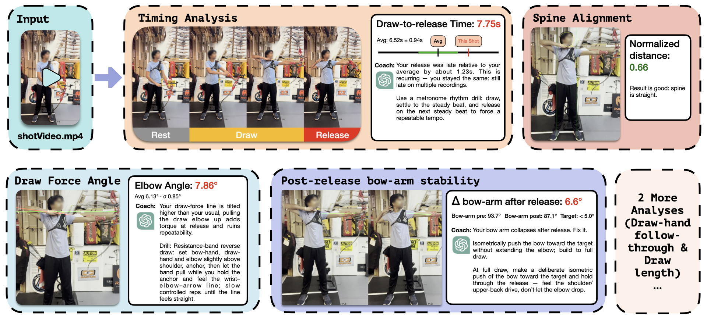

<h3 align="center">
  
  
  <br>
  STRAIGHT: Toward Consistent Archery Form via Video Pose Analysis and Language-Model-Based Coaching Feedback

</h3>

<h4 align="center">
  <a href="https://www.youtube.com/watch?v=cwOr7fjffl0" title="Demo" style="text-decoration:none;">
    
  </a>
</h4>


<p align="center">
    
    
</p>
STRAIGHT’s analysis output. Given a single-shot practice clip, STRAIGHT computes quantitative metrics for each aspect of the shot and provides coaching suggestions when inconsistency/instability is detected.


## Abstract

Accurate archery performance relies on consistent timing, alignment, and post-release follow-through across repeated shots, yet archery athletes often train without continuous feedback because a coach cannot observe every attempt. To address this gap, we introduce STRAIGHT, a system that turns simple practice clips into suggestions that resemble feedback from an experienced coach. STRAIGHT first detects the shot phase and estimates the archer’s pose. Each shot is evaluated in the context of the archer’s prior attempts, quantifying how consistently timing, alignment, and stability are reproduced across repetitions. An LLM-based feedback generation system then analyzes the results and delivers customized coaching-style feedback to the archer. Demonstrations with real practice footage show that STRAIGHT detects inconsistencies, instability, and subtle alignment changes, and provides feedback that helps athletes develop more stable and repeatable technique. The codebase will be released upon acceptance for the community to use.

## Project Page
Please see anonymized details about the project [here](https://straight-anon.github.io/STRAIGHT/), including the **demonstration video**, and the **installation documentation**.

## Usage

[Installation Guide](https://straight-anon.github.io/STRAIGHT/installation.html)

## Experiment and Dataset🤗

The release frame detection experiment in Table 1 uses a dataset of 51 self-recorded bow shooting videos, which are publicly released on Hugging Face. The dataset can be loaded as follows:

```python
from datasets import load_dataset
# will be released upon acceptance
```
Detailed instructions for reproducing the experiment, including model configuration, verification protocol, and evaluation workflow, are provided in [recreate_experiment.md](recreate_experiment.md)
.


## License

This project is licensed under the **GNU General Public License v3.0 (GPL-3.0)**.

You may use, modify, and redistribute this project, but any derivative work must also be released under GPL-3.0 and remain fully open source.  
Commercial use is allowed as long as the derived work follows the same license.

See the [LICENSE](./LICENSE) file for the complete terms.

